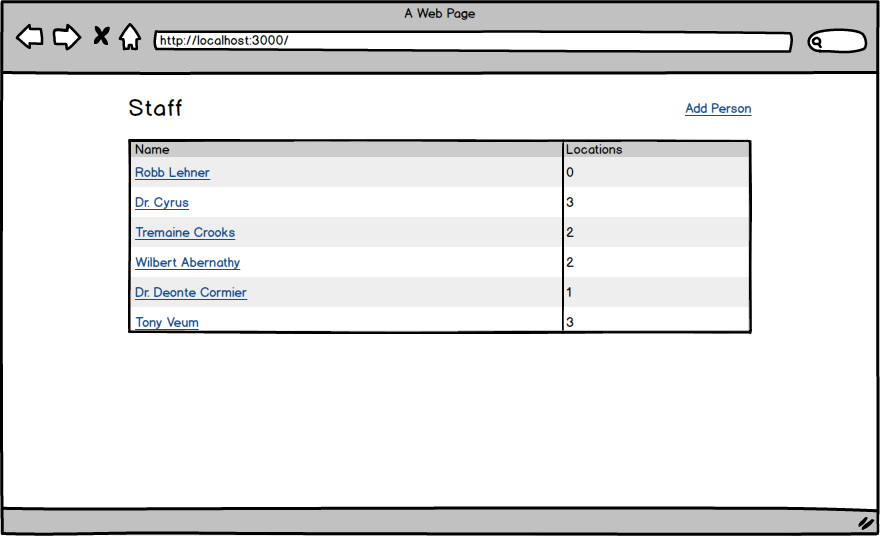
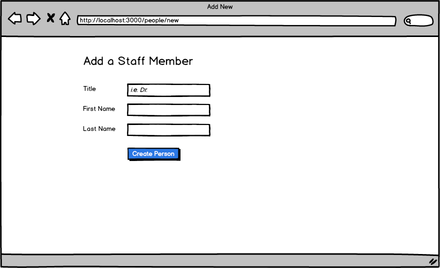
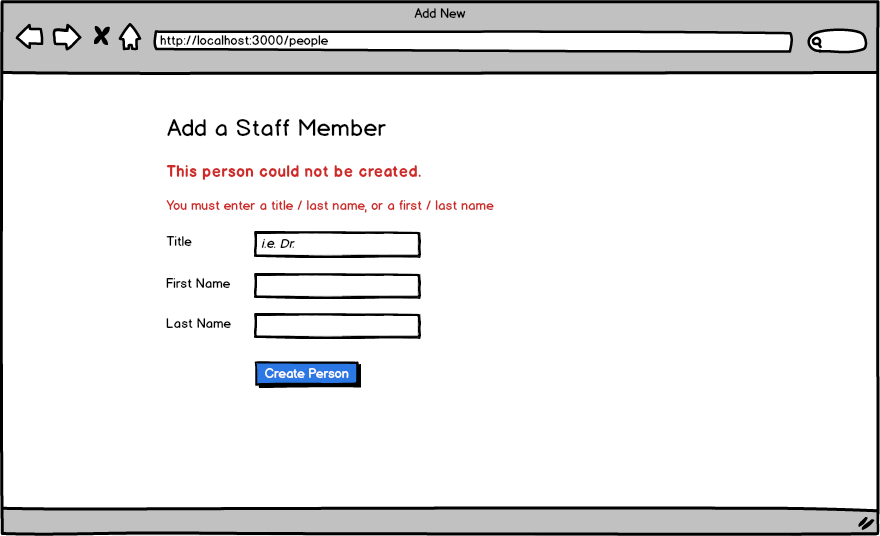
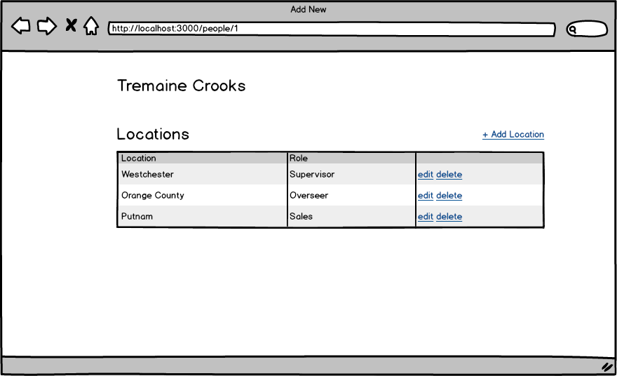
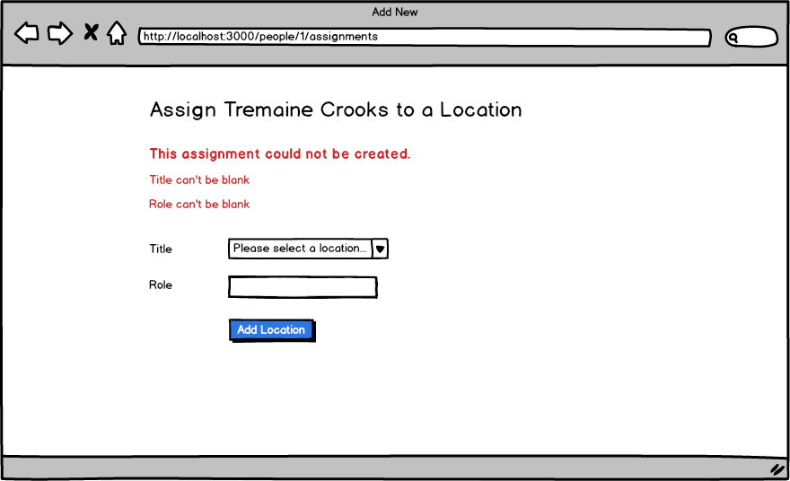

# Rails Practice - Staff Assignments

## Setup

* `bundle`
* `rake db:create db:migrate db:seed`
* `rails s`

You can run specs with:

* `rspec`

Note: email/password combinations for existing users populated by `rake db:seed` can be found in the db/seeds.rb file.

## Stories

**Users can see a person show page**

```
On the index page the names should be links
Clicking link brings users to show page
```

**Users can edit people**

```
From the person show page
Users should be abel to click an edit link and see the edit form for a person 
```

**Users must enter a title/last_name or first_name/last_name**

```
While adding or editing a person
Users must enter either a title/last_name or a first_name/last_name
Otherwise they get a validation message and the person isn't saved
```

**Users can assign users to locations**

```
Go to person show page
Click on "+ Add Location"
Fill out form
View assignment on person show page
Assignments must have both a location and a role
```

**People cannot be assigned to the same location with the same role**

```
A person can be assigned to "Northeast" more than once, as long as the role is unique
But a person cannot be assigned as "Sales Manager" to "Northeast" twice
```

**Users can edit assignments**

```
Go to person show page
Click on the "edit" link by an assignment
Fill out form
View updated assignment on person show page
```

**Users can delete assignments**

```
Go to person show page
Click on the "delete" link by an assignment
Javascript prompt that says "Are you sure?" should appear
If user clicks "OK" then it should be deleted
```

**Users see assignment count on the home page**

```
Go to the home page
You should see the total number of assignments next to each person
```

## Wireframes

**Index**



**New Person**



**New Person w/ Errors**



**Person Show Page**



**New Location Page**


**New Location w/ Errors**



## References

* [collection_select](http://api.rubyonrails.org/classes/ActionView/Helpers/FormOptionsHelper.html#method-i-collection_select)
* [custom validations](http://guides.rubyonrails.org/active_record_validations.html#custom-methods)